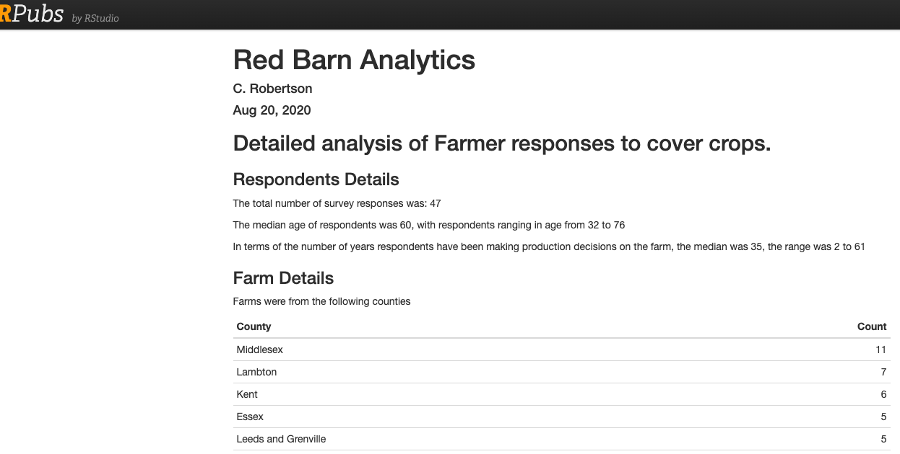

# Data/Analytic Visualization

<!-- A list of topics to be covered in this section; -->

<!-- * geospatial data formats -->
<!--   * vector and OGC -->
<!--   * raster -->
<!-- * rgdal -->
<!-- * netCDF -->
<!-- * stacs -->
<!-- * API access -->
<!-- * IoT and sensor data -->


<!-- <!-- https://planetarycomputer.microsoft.com/api/stac/v1/collections/daymet-daily-na --> 
<!-- <!--https://loreabad6.github.io/foss4g/slides.html#10 -->

<!-- [Time series data](https://observablehq.com/collection/@observablehq/analyzing-time-series-data) -->


## Tabular Data
### Readings this week {#tab-readings}

* [TCL-4 Effective Visualization](https://ubc-dsci.github.io/introduction-to-datascience/viz.html)
* [HNP-1 Introduction](https://ggplot2-book.org/introduction.html)
* [HNP-2 First Steps](https://ggplot2-book.org/getting-started.html)
* [HNP-3 Individual geoms](https://ggplot2-book.org/individual-geoms.html)
* [HNP-4 Collective geomes](https://ggplot2-book.org/collective-geoms.html)
* [HNP-5 Statistical summaries](https://ggplot2-book.org/statistical-summaries.html)
* [ggplot2 Cheat Sheet](https://rawgit.com/rstudio/cheatsheets/master/data-visualization.pdf)

### Case Study {#tab-case}
Surveying farmers about agricultural practices. This project was in consultation with an environmental agriculture association aiming to understand barriers to the adoption of specific farming practices, specifically the use of [cover crops](https://www.sare.org/resources/cover-crops/).

```{r echo=FALSE, fig.cap='Red Clover cover crops on farm field. Image credit: https://www.country-guide.ca/', out.width='60%', fig.asp=.75}
knitr::include_graphics('img/covercrops.jpeg')
```

The survey asked farmers about their use of cover crops  and any barriers they experienced in applying this practice to their farms. We will walk-through a detailed analysis of this farmer survey data, which is primarily tabular data with some spatial and temporal components.

First, let's look at the raw data.
```{r echo=FALSE, fig.cap='Snapshot of farmer  survey data', out.width='90%', fig.asp=.75}
knitr::include_graphics('img/covercropsdata.png')
```

Some things you need to check when inspecting a new dataset, include at least the following:

* are the column names well-formed
* what columns have NULL values, will this cause an issue
** how are NULL values coded, is it consistent?
* do any columns have a mix of data types? (e.g., see column `AH`)
* is there data that should anonymized?
* are there gaps above or below the data, or ad hoc summaries that need to be removed?
* are there any obviously erroneous values (i.e., not valid outliers but errors, such as a value of `491` in the `age` column) that need to be removed

As well as some deeper questions:

* do you understand what each column and value means, what each row represents? If there are some you do not understand consider whether the columns you do understand are sufficient to answer the key questions you're exploring with this dataset
* are the data stored in the correct data type (especially important if viewing data in Microsoft Excel)
* are the data complete? (i.e., are all the expected rows there, does the rowcount = the sample size)

Secondly, let's examine the end product we created to explore this data. The graphs here were used in a report summarizign key trends.

```{r echo=FALSE, fig.cap='Screenshot of farmer survey report. [View the full report here.](https://rpubs.com/colinr23/farmers)', out.width='90%', fig.asp=.75}

```

## Time Series Data
### Readings this week {#time-readings}

* [Neon Tutorial - Time Series with ggplot2 in R](https://www.neonscience.org/resources/learning-hub/tutorials/dc-time-series-plot-ggplot-r)
* [Lubridate Cheat Sheet](https://rawgit.com/rstudio/cheatsheets/master/lubridate.pdf)

### Case Study {#time-case}

## Spatial Data
### Readings this week {#space-readings}

* [Lovelace-8 Making maps with R](https://geocompr.robinlovelace.net/intro.html)
* [HNP-6 Maps](https://ggplot2-book.org/maps.html)

### Case Study {#space-case}

## Model Data
### Readings this week {#model-readings}

* [jtools package](https://cran.r-project.org/web/packages/jtools/vignettes/effect_plot.html)
* [visualizing models 101](https://towardsdatascience.com/visualizing-models-101-using-r-c7c937fc5f04)

### Case Study {#model-case}
